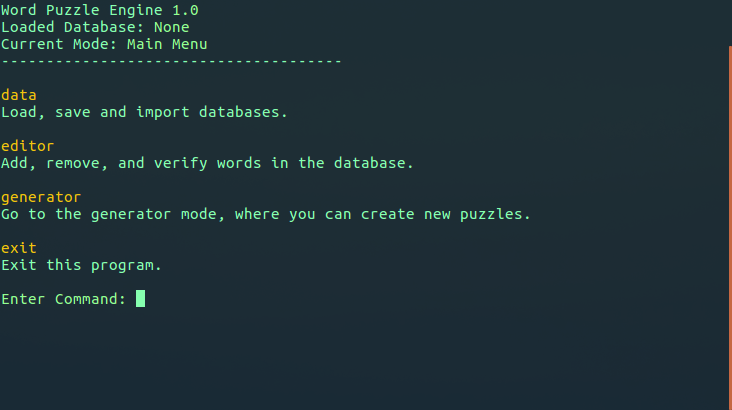

# Word Puzzle Engine

*by Jakrin Juangbhanich (juangbhanich.k@gmail.com) 2018*

WP-Engine is a program that can help you organize a database of words, and from it, generate anagram puzzles in a CSV format. To start, you can use the pre-existing database bundled with this repo, or you can import a word list (as a plaintext file) to create a new database. From inside the program, you can edit the database (add, remove, and verify words) and generate puzzles. I hope you enjoy using this program to generate content for Word Games. Please send me any feedback or suggestions :)


## Quick Start Guide

- Clone this repo and navigate to the wp-gen directory with a UNIX terminial. Mac and Linux will have this by default. If you are on Windows 10, then check out the official [Ubuntu Bash subsystem](https://docs.microsoft.com/en-us/windows/wsl/install-win10).
- Make sure that you have Python 2.7 installed. If you type `python` into the terminal, it should open up the default Python interpreter).  This usually comes default with the OS.  If it is not there, please install it manually.
- Type `python run_wpg.py` to start the program. The program should now appear in the terminal and you can start using it by following the on-screen instructions.





## Sections

WP-Engine is divided into three distinct sections. Type in the section name to open up that section's menu, and to see the commands availiable within that section. **Note: The commands are listed in each section can actually be called from any menu. So for example, you don't have to be in the Editor menu to use any of the Editor commands.**

#### Data

- Import a new text file into the program, and convert it into a word database.
- Load an existing database that you have been working on.
- View the information (stats) of the current database.
- Save the database.

#### Editor

- Add and remove words from the database.
- Verify the words (check each unverified word, one-by-one, and manually approve or reject it).

#### Generator

- Generate a pre-made puzzle set as CSV files (the structure is fixed, but can be adjusted within the `engine.py` script).
- Generate and display single (sample) puzzles for a given letter-count.
- Inspect a word, and see its anagram group.


## Data Commands

#### Loading a Database

##### `load_db [file_path]`

Use this to load an existing database. A default database is included, `save_dict`. The below command will load this database. Once a database is loaded, the header will update to show the current active database.

```python
# Loads the default save_dict database.
load_db save_dict
```


#### Loading a Text File

##### `load_txt [file_path]`

If you want to load in a raw text file instead, use this command. This will load in a plaintext file, and parse it into a database. You will be prompted to enter a name for this new database. The demo text file included is `eng_dict`.

```python
# Loads the text file 'eng_dict' into a new database.
load_txt eng_dict
```


#### Display Database Information

##### `info`

Type this to show the stats of the current database. It will show how many words there are, and how many still need to be 'verified.'


#### Saving the Database

##### `save`

This will save the current database in place. If you want to make a copy, you need to copy and paste it manaully from the terminal or a file explorer.


## Editor Commands

#### Adding Words

##### `add [word]`

Use this to add a word into the database. If the word already exists, this command will cause the word to be verified. You can specify more than one word to add/verify at once.

```python
# Add 'apple' to the database.
add apple

# Add 'apple', 'banana' and 'cat' to the database.
add apple banana cat
```


#### Removing Words

##### `remove [word]`

Use this to remove a word from the database. You can specify more than one word to remove at once.

```python
# Remove 'apple' from the database.
remove apple

# Remove 'apple', 'banana' and 'cat' to the database.
remove apple banana cat
```


#### Verify Existing Words

##### `verify`

By default, all the words loaded in from a text file are *unverified*. This means that it exists in the dictionary, but we haven't yet manually determined if the word is fit for being included in the system. This command will bring up a separate sub-routine, in which you will be shown an unverified word, and asked either to accept or reject it. Accepted words will be considered verified. **Rejected words will be deleted from the database.** If you incorrectly reject or verify a word, you can add/remove it manually using the commands above.


## Generator Commands

*Note: Using any of the generation commands requires the engine to calibrate the database first. This can take a few minutes. The database will need to be calibrated again whenever it is loaded, or edited.*

#### Generate the Puzzle CSVs

##### `generate`

Generate a group of puzzles, pre-bundled into CSVs. The CSVs will be saved in an output folder relative to the directory that this script is being run from. Each CSV will contain a number of different puzzles. Each puzzle is delimited by a new line, and looks like this:

```python
# 'deirw' is the key of the puzzle. It is the letters avaliable to the player.
# The following words, delimited by a space, are the actual puzzle words.
deirw,dew die ire red rid wed dire drew ride wide wire weird
```

The CSVs can then be edited manually with a text editor to further fine-tune the puzzles.


#### Generate a Single (Sample) Puzzle

##### `single [n_letters] [n_puzzles]`

Generate and displays a random puzzle. The puzzle will have a key of length **n_letters**. The generator will also repeat this operation **n_puzzles** times.

```python
# Generate a 5-key puzzle, 3 times.
single 5 3

# Outputs:
KEY: abhor
WORDS: bar boa hob oar orb rob boar hoar abhor

KEY: abelr
WORDS: ale are bar ear era lab able bale bare bear real blare

KEY: eginv
WORDS: gin give vein vine given
```

These can be copy and pasted into the CSV manually as well. *Remember to replace both the **key** and the **words**.*


#### Inspect Word

##### `inspect [word]`

Inspects the specified word, showing all the anagram combinations avaliable for that word.

```python
# Inspects the 'apple' word.
inspect apple

# Outputs:
Analysing String: apple
Key: aelpp
Word Count: 11
Words: ale, ape, lap, pap, pea, pep, leap, pale, palp, plea, apple
```


